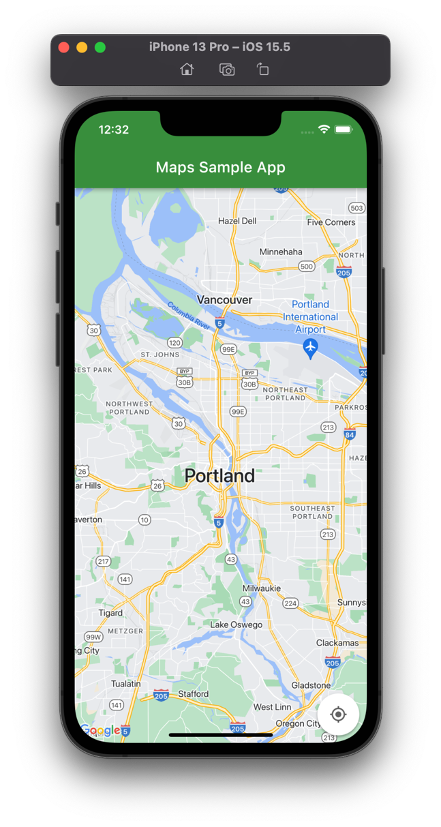
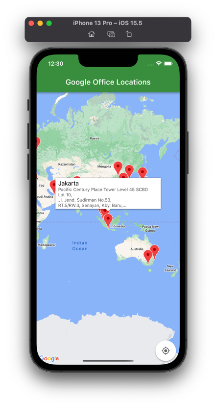
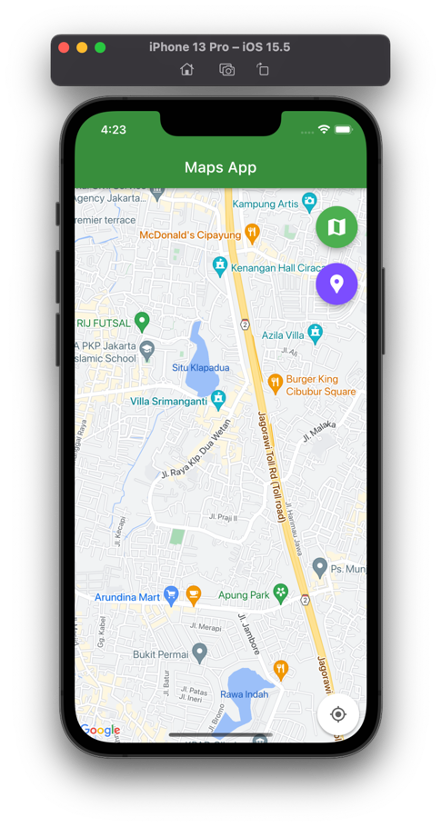
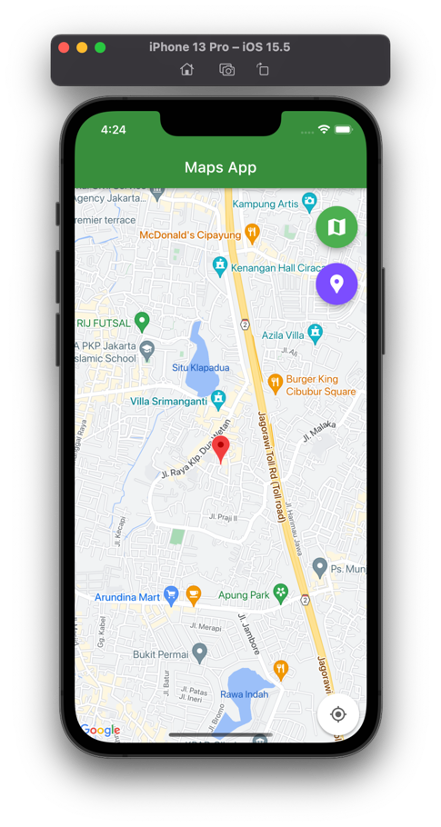
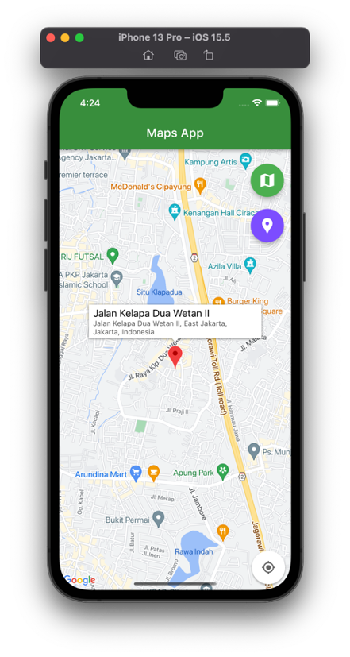
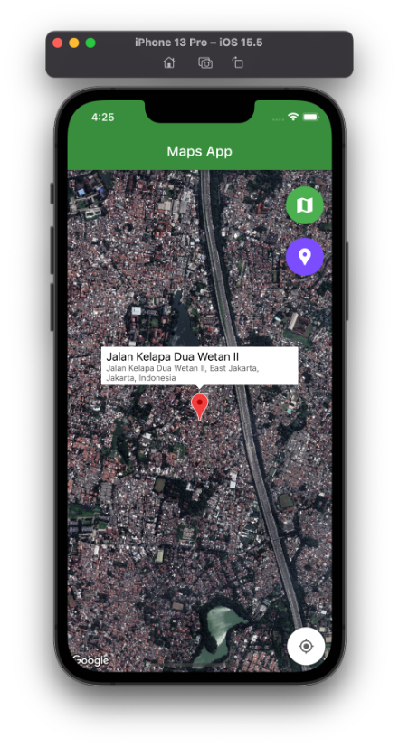

# Google Maps in Flutter

## Langkah-langkah Praktikum 

### Menambahkan Google Maps ke Aplikasi

1. Menambahkan plugin Google Maps Flutter sebagai dependensi
  
   `flutter pub add google_maps_flutter`
   
   `flutter pub add google_maps_flutter_web`
   
2. Mengkonfigurasi platform iOS

    ```
    # Set platform to 11.0 to enable latest Google Maps SDK
    platform :ios, '11.0' # Uncomment and set to 11.

    # CocoaPods analytics sends network stats synchronously affecting flutter build latency.
    ENV['COCOAPODS_DISABLE_STATS'] = 'true'
    ```

3. Menambahkan kunci API untuk aplikasi iOS

   `import GoogleMaps`
   
   `GMSServices.provideAPIKey("YOUR-API-KEY")`
   
4. Menambahkan kunci API untuk aplikasi WEB

    ```
    <!-- TODO: Add your Google Maps API key here -->
    <script src="https://maps.googleapis.com/maps/api/js?key=YOUR-KEY-HERE"></script>
    ```
 5. Menampilkan peta di layar pada file `main.dart`.
 
  
 
 ### Menempatkan Google di Peta
 
 1. Menambahkan dependency **http**.
 
    `flutter pub add http`
 
 2. Menambahkan **json_serializable**.
 
    `flutter pub add json_serializable`
    
 3. Menambahkan **build_runner** pada dependensi waktu pengembangan.
 
    `flutter pub add --dev build_runner
    
 4. Menguraikan JSON dengan pembuatan kode.
 
 5. Menjalankan **build runner**.
 
    `flutter pub run build_runner build --delete-conflicting-outputs`
 
 6. Membuat folder assets dan file `location.json`. 
 
 7. Menambahkan assets pada pubspec.yaml.
 
 8. Menampilkan lokasi Google di layar pada file `main.dart`. 
 
  
 
 ## Tugas
 
 Menambahkan maker pada posisi rumah. 
 
 | Mode Map Normal | Pin Lokasi |
 | --------------- | ----------------- |
 |  |  |
 
 | Muncul Info Ketika Klik Pin Lokasi | Mode Map Satelit  |
 | --------------- | ----------------- |
 |  |  |
 

 
 
